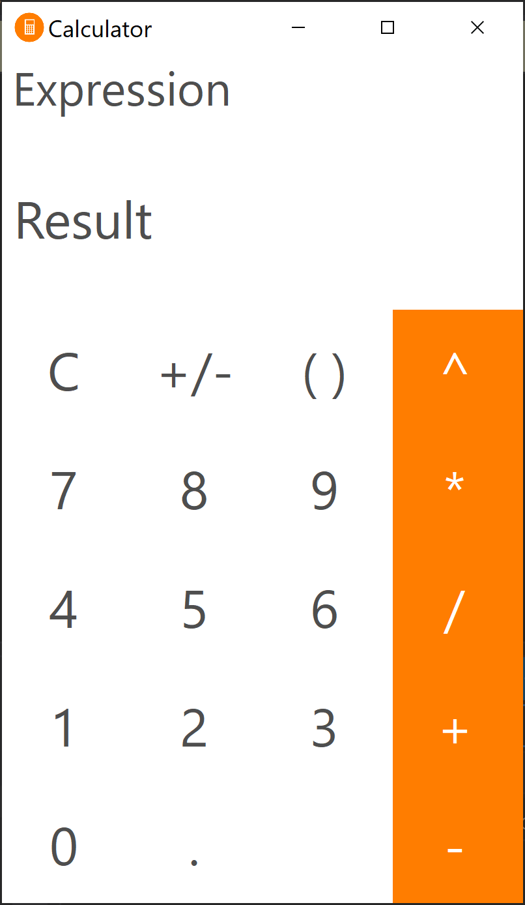

# Calculator

</img>

The fast standard calculator written in C#.

Directory | Role
----------|-----
src       | Project's source files folder
docs      | Project-related documentation folder

## Features

* Real-time expression calculation
* Infinite precision arithmetic operations
* Expression calculation following the order of operations
* Smart expression manipulations
* Keyboard shortcut support
* History buffer support

## Roadmap

- [X] Implement infinite precision arithmetic operations
- [X] Implement expression calculation following the order of operations
- [ ] Implement smart expression manipulation capabilities
- [X] Design the application's user interface
- [ ] Implement text overflow protection label
- [ ] Link the frontend to backend components
- [ ] Resize the application's user interface
- [ ] Provide project-related documentation

Project is approximately 70% complete.

## License

Work in progress! The project will soon be available under the MIT license.
