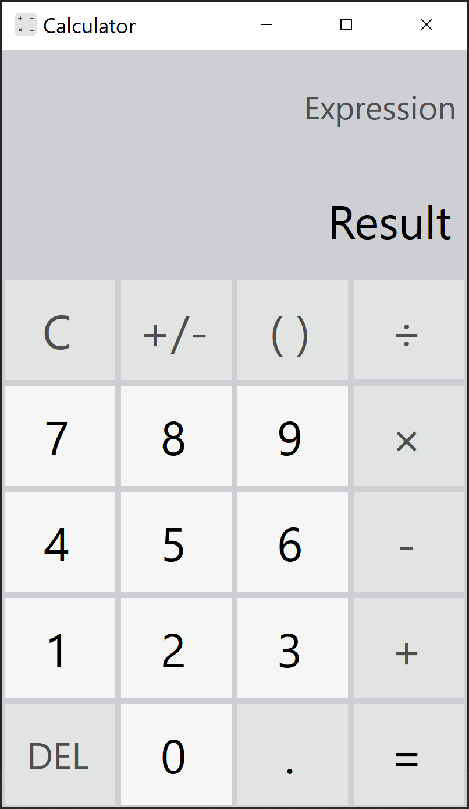

# Calculator

</img>

An efficient, lightweight, keyboard-centric calculator utility written in pure C#

Directory | Role
----------|-----
src       | The Project's source files folder
docs      | The Project-related documentation folder

## Features

* Infinite precision for arithmetic operations
* Expression evaluation following the order of operations
* Efficient expression modifications
* Keyboard shortcut support
* Button warning support

## Roadmap

- [X] Implement the infinite precision arithmetic library
- [X] Implement the expression parser and manipulator libraries
- [X] Design and implement the application's user interface
- [X] Implement the keyboard shortcut capabilities
- [X] Implement the button warning capabilities
- [X] Resize the application's user interface
- [X] End-of-project general refactoring
- [X] License project under the MIT license
- [ ] Provide project-related documentation

The "Calculator" project is now ready to be publicly released

## License

Copyright © 2022 Nicolae Petri

Licensed under the [MIT License](./LICENSE).
