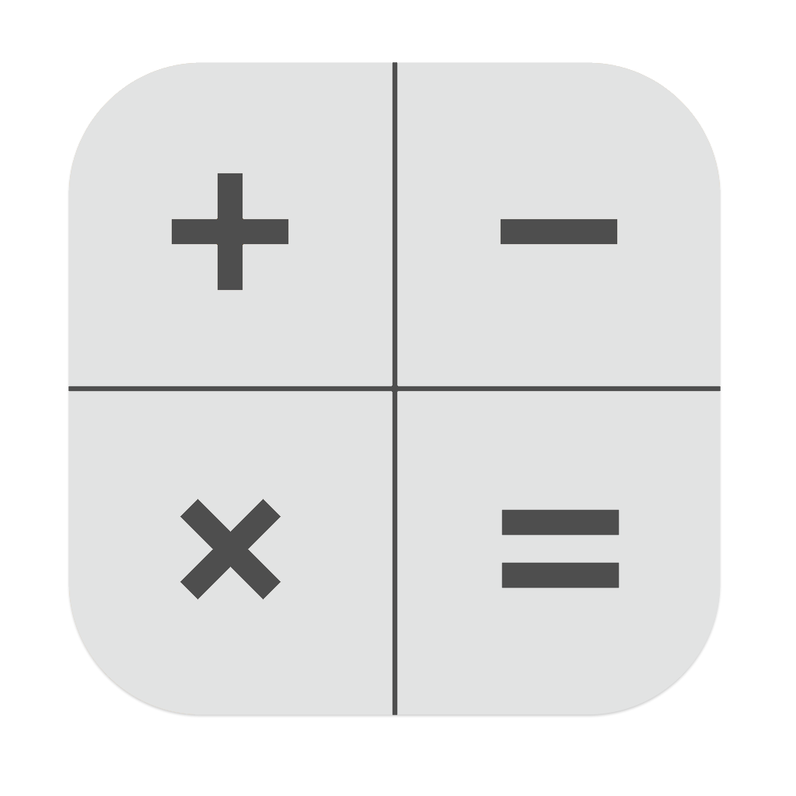

# Calculator

The fast standard calculator written in C#

## Features

* Real-time expression calculation
* Infinite precision arithmetic operations
* Expression calculation following the order of operations
* Efficient expression manipulations
* Keyboard shortcut support
* History buffer support

## Project structure

Directory | Purpose
----------|-----------------------------
src       | Project's source files
docs      | Detailed project information

## License

Work in progress! The project will soon be licensed under the MIT license.
